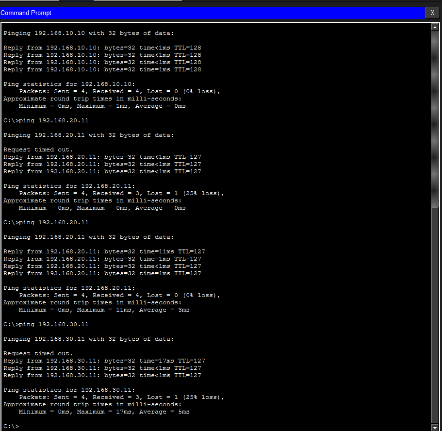

# 🏢 Small Office Network Design & Implementation

## 📌 Project Overview

This project demonstrates the design and implementation of a small office network using Cisco Packet Tracer.

The network is divided into multiple departments using VLANs. Router-on-a-Stick is implemented to enable communication between different VLANs.

## 🎯 Objectives

- Create department-based VLANs
- Configure IPv4 addressing
- Configure switch access ports
- Configure 802.1Q trunking
- Configure Router-on-a-Stick
- Implement Inter-VLAN Routing
- Test connectivity between VLANs
- Verify the network using Cisco IOS commands

## 🏗️ Network Topology


## 🌐 VLAN & IP Addressing

| Department | VLAN | Network | Gateway |
|------------|------|---------|---------|
| HR | 10 | 192.168.10.0/24 | 192.168.10.1 |
| IT | 20 | 192.168.20.0/24 | 192.168.20.1 |
| Sales | 30 | 192.168.30.0/24 | 192.168.30.1 |

## 💻 PC Addressing

| Device | VLAN | IP Address | Default Gateway |
|--------|------|------------|-----------------|
| PC1 | 10 | 192.168.10.10 | 192.168.10.1 |
| PC2 | 10 | 192.168.10.11 | 192.168.10.1 |
| PC3 | 20 | 192.168.20.10 | 192.168.20.1 |
| PC4 | 20 | 192.168.20.11 | 192.168.20.1 |
| PC5 | 30 | 192.168.30.10 | 192.168.30.1 |
| PC6 | 30 | 192.168.30.11 | 192.168.30.1 |

## 🔧 Technologies Used

- Cisco Packet Tracer
- Cisco IOS
- VLAN
- IPv4 Addressing
- Access Ports
- 802.1Q Trunking
- Router-on-a-Stick
- Inter-VLAN Routing
- ICMP Ping

## ⚙️ VLAN Configuration

```bash
vlan 10
name HR

vlan 20
name IT

vlan 30
name SALES
```

## 🔌 Access Port Configuration

### HR

```bash
interface range fa0/2-3
switchport mode access
switchport access vlan 10
```

### IT

```bash
interface range fa0/4-5
switchport mode access
switchport access vlan 20
```

### Sales

```bash
interface range fa0/6-7
switchport mode access
switchport access vlan 30
```

## 🔗 Trunk Configuration

The connection between SW1 and R1 is configured as an 802.1Q trunk.

```bash
interface fa0/1
switchport mode trunk
no shutdown
```

## 🌐 Router-on-a-Stick Configuration

### Physical Interface

```bash
interface g0/0
no shutdown
```

### VLAN 10 — HR

```bash
interface g0/0.10
encapsulation dot1Q 10
ip address 192.168.10.1 255.255.255.0
```

### VLAN 20 — IT

```bash
interface g0/0.20
encapsulation dot1Q 20
ip address 192.168.20.1 255.255.255.0
```

### VLAN 30 — Sales

```bash
interface g0/0.30
encapsulation dot1Q 30
ip address 192.168.30.1 255.255.255.0
```

## 🔄 How Inter-VLAN Routing Works

A host in VLAN 10 cannot directly communicate with a host in VLAN 20 through Layer-2 switching because they belong to different IP networks.

The source PC sends traffic to its default gateway. The switch carries the traffic over the 802.1Q trunk to the router. The router receives the traffic through the appropriate subinterface, routes it to the destination VLAN, and sends it back through the trunk.

Example:

```text
PC1 — VLAN 10
      ↓
     SW1
      ↓
802.1Q Trunk
      ↓
     R1
      ↓
Inter-VLAN Routing
      ↓
     SW1
      ↓
PC3 — VLAN 20
```

## 🧪 Verification Commands

### Check VLANs

```bash
show vlan brief
```

### Check Trunk

```bash
show interfaces trunk
```

### Check Router Interfaces

```bash
show ip interface brief
```

### Check Routing Table

```bash
show ip route
```

## 🧪 Connectivity Testing

From a PC in VLAN 10:

```bash
ping 192.168.20.10
```

Test VLAN 30:

```bash
ping 192.168.30.10
```

Successful replies confirm that Inter-VLAN Routing is working.

## 📸 Project Screenshots

### VLAN Configuration


### Trunk Configuration


### Router Configuration


### Router Interface Status


### Inter-VLAN Connectivity Test



## ✅ Project Result

Successfully designed and implemented a small office network with department-based VLAN segmentation.

Inter-VLAN communication was successfully established using Router-on-a-Stick, and connectivity was verified using ICMP ping and Cisco IOS verification commands.

## 📚 Key Learning Outcomes

- VLAN segmentation
- IPv4 addressing
- Access port configuration
- 802.1Q trunking
- Router subinterfaces
- Router-on-a-Stick
- Inter-VLAN Routing
- Default gateway configuration
- Cisco IOS verification commands
- Basic network troubleshooting

## 📂 Project Files

- `small-office-network.pkt` — Cisco Packet Tracer project
- `topology/small-office-topology.png` — Network topology
- `documentation/Small_Office_Network_Documentation.pdf` — Detailed documentation
- `screenshots/` — Configuration and testing screenshots

## 👨‍💻 Author

**Prathamesh Jondhale**

CCNA | Networking | Cybersecurity
